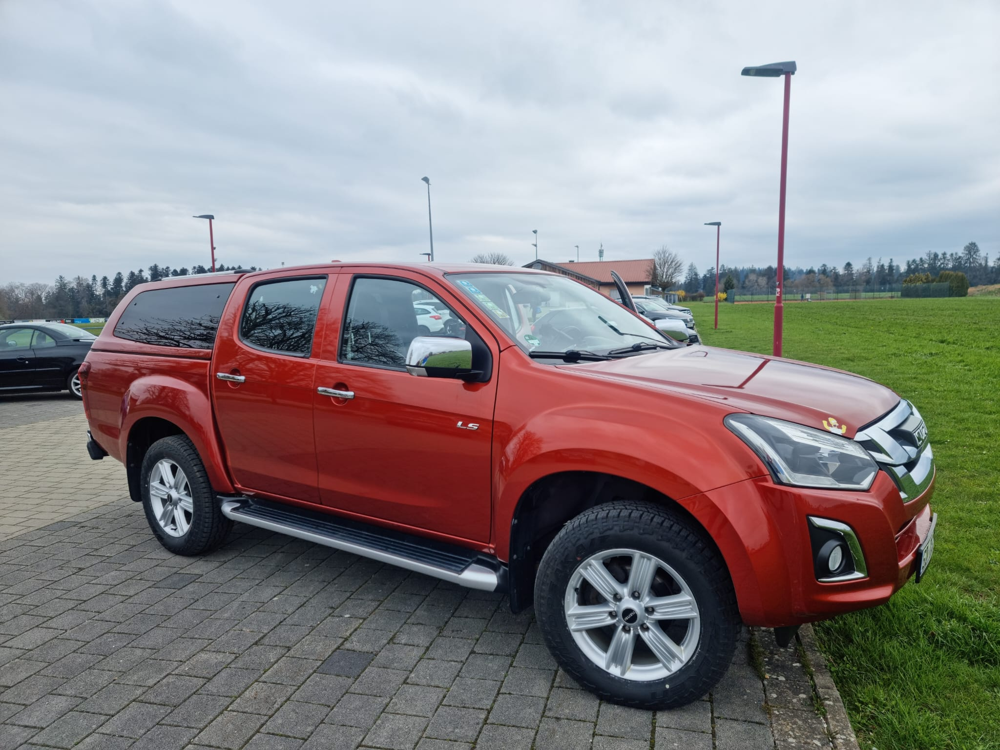
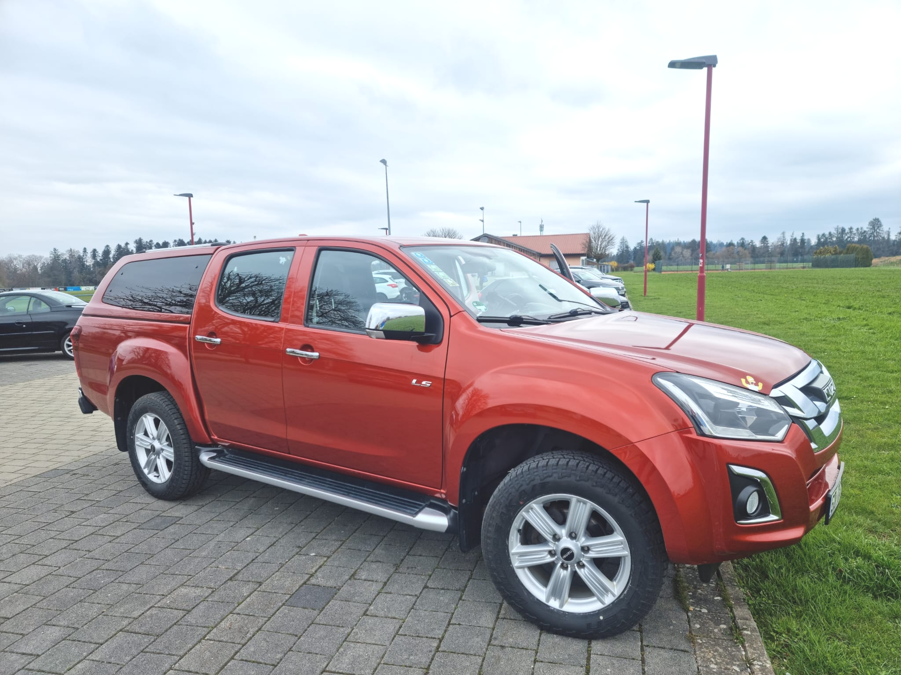
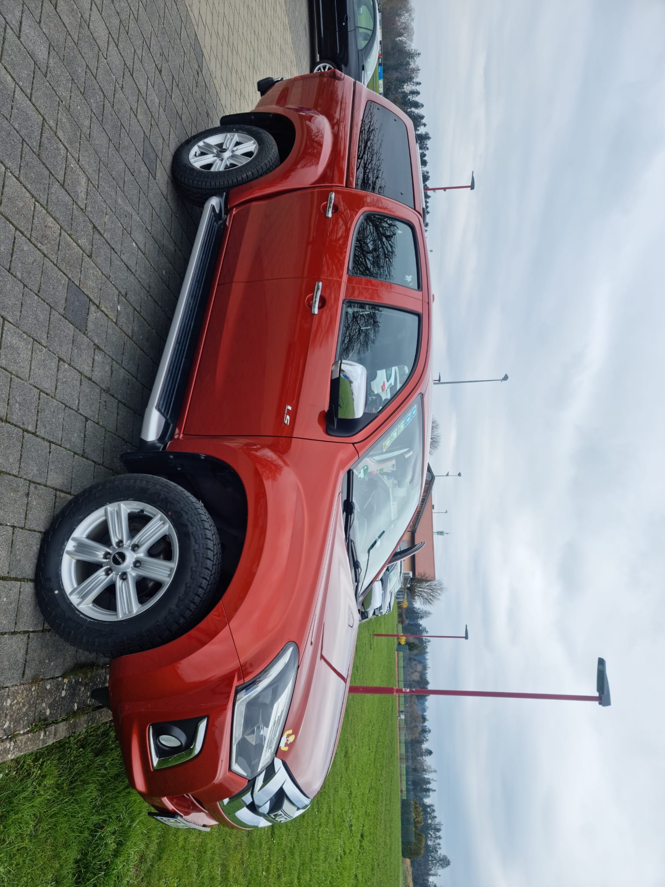
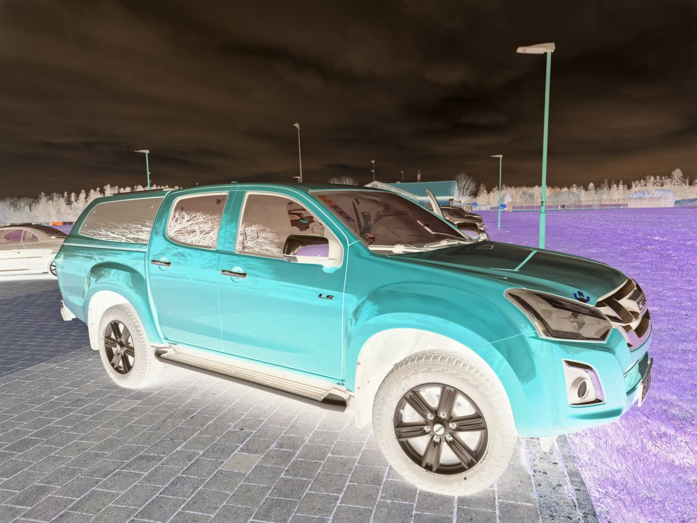
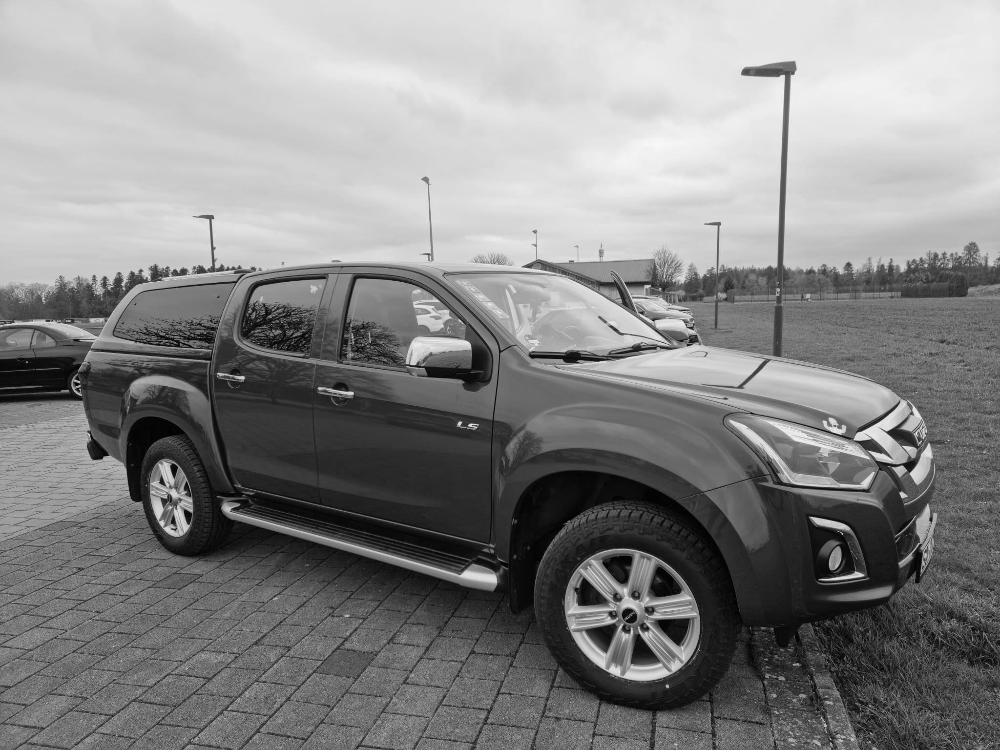
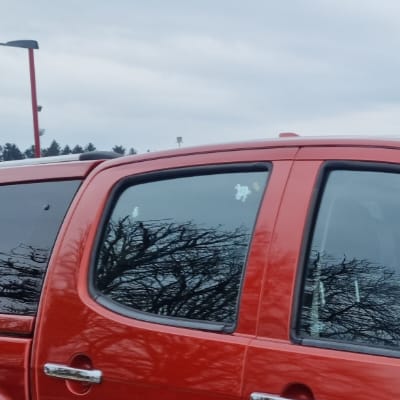
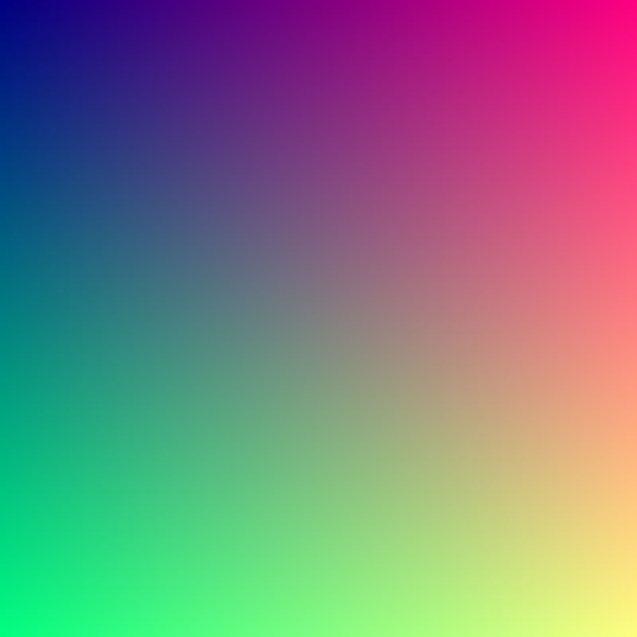

# PixelFerris 🦀🖼️

A command-line image manipulation tool written in Rust, demonstrating various image processing capabilities using the `image` crate.

## Features

PixelFerris provides several image manipulation commands:

- **Blur** - Apply Gaussian blur to images
- **Brighten** - Increase image brightness
- **Rotate** - Rotate images 90 degrees
- **Invert** - Invert image colors
- **Grayscale** - Convert images to grayscale
- **Crop** - Crop a portion of an image
- **Fractal** - Generate a fractal image
- **Generate** - Generate a gradient image

## Installation

Make sure you have Rust installed. Then clone and build the project:

```bash
git clone https://github.com/AlexTLDR/PixelFerris.git
cd PixelFerris
cargo build --release
```

## Usage

```bash
cargo run <COMMAND> [ARGUMENTS]
```

**Tip:** When in doubt, use a `.png` extension for output filenames to ensure compatibility.

### Commands

#### Blur
Apply a Gaussian blur effect to an image.

```bash
cargo run blur <INFILE> <OUTFILE>
```

Example:
```bash
cargo run blur isuzu2.jpg blurred.png
```

#### Brighten
Increase the brightness of an image.

```bash
cargo run brighten <INFILE> <OUTFILE>
```

Example:
```bash
cargo run brighten isuzu2.jpg brightened.png
```

#### Rotate
Rotate an image 90 degrees clockwise.

```bash
cargo run rotate <INFILE> <OUTFILE>
```

Example:
```bash
cargo run rotate isuzu2.jpg rotated.png
```

#### Invert
Invert the colors of an image (negative effect).

```bash
cargo run invert <INFILE> <OUTFILE>
```

Example:
```bash
cargo run invert isuzu2.jpg inverted.png
```

#### Grayscale
Convert an image to grayscale.

```bash
cargo run grayscale <INFILE> <OUTFILE>
```

Example:
```bash
cargo run grayscale isuzu2.jpg grayscaled.png
```

#### Crop
Crop a specific region from an image.

```bash
cargo run crop <INFILE> <OUTFILE>
```

Example:
```bash
cargo run crop isuzu2.jpg cropped.png
```

#### Fractal
Generate a fractal image (Julia set).

```bash
cargo run fractal <OUTFILE>
```

Example:
```bash
cargo run fractal fractal.png
```

#### Generate
Generate a gradient image.

```bash
cargo run generate <OUTFILE>
```

Example:
```bash
cargo run generate generated.png
```

## Examples

### Original Image


### Blur Effect


### Brighten Effect


### Rotate Effect


### Invert Effect


### Grayscale Effect


### Crop Effect


### Fractal Generation


### Gradient Generation


## Dependencies

- [image](https://github.com/image-rs/image) - Image processing library
- [num-complex](https://github.com/rust-num/num-complex) - Complex number support for fractal generation

## License

This project is licensed under the MIT License - see the [LICENSE](LICENSE) file for details.


## Author

[AlexTLDR](https://alextldr.com/)

